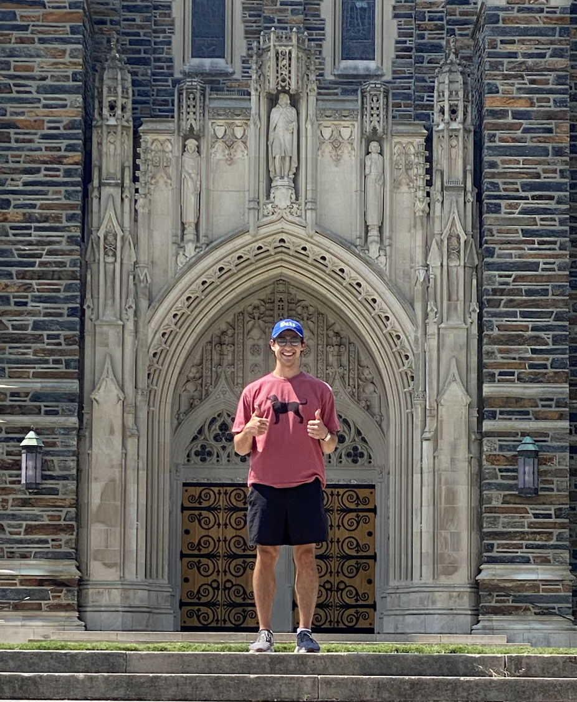

# Hi, I'm Leo :) 🚀 💻

## :book: About me

- :computer: Master's in artificial intelligence at Duke University (08/2021-)
- :mortar_board: Bachelor's in electrical engineering from the University of Notre Dame '21
- :fire: Data science
- :keyboard: VS Code gang (how do you exit VIM?!?)

I am a recent graduate of the University of Notre Dame with a bachelor's in electrical engineering, and a current master's student at Duke University studying artificial intelligence. I love data, college football (go Irish ☘️ !!), working out, and spending time with my family and friends. 

I just completed my first semester at Duke University. I love the school, my professors, and the area. It's amazing what the weather in Durham, NC can do for you after spending the last 4 years in freezing and cloudy northern Indiana!

## 💻 Skills
- 👨‍💻 Python: OOP principles, numpy, pandas, sklearn, pytorch
- 🧮 Math & Statistics: Linear algebra, multivariable calculus and diff. equations, statistical learning methods, statistical data analysis 
- 💾 Version control: I can push/pull, init/clone, add, and commit. I'm a work in progress with branching :)
- ✍️ Strong verbal and written communication skills
- 😁 An infectiously positive attitude and strong willingness to learn!

## 🚀 Future plans

I have been working relentlessly over the past 7 months both on my own and in school to learn, practice, and become a better data scientist. I am building my github repositories so that everyone can see what I have been working on. I am currently looking for a 2022 data science summer internship to continue my learning process. I take tremendous pride in and ownership of my work, I'm a very fast learner, and I love working with people and being a part of something bigger than myself. 

<!--
**leocorelli/leocorelli** is a ✨ _special_ ✨ repository because its `README.md` (this file) appears on your GitHub profile.

Here are some ideas to get you started:

- 🔭 I’m currently working on ...
- 🌱 I’m currently learning ...
- 👯 I’m looking to collaborate on ...
- 🤔 I’m looking for help with ...
- 💬 Ask me about ...
- 📫 How to reach me: ...
- 😄 Pronouns: ...
- ⚡ Fun fact: ...
-->
